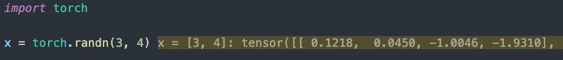

# PyTorch Debug Shape Extension for VS Code

This extension automatically installs a `pydevd` plugin to display PyTorch tensor shapes in the VS Code debugger.

## Usage

1. Install this extension.
2. Open the Command Palette (`Ctrl+Shift+P`).
3. Run `PyTorch Debug Shape: Install PyTorch Debug Plugin`.
4. Reload VS Code.

## Development

1. Run `npm install` to install dependencies.
2. Run `npm run compile` to build the extension.

## Manual Installation (if you want to create a .vsix)

1. Install `vsce`: `npm install -g @vscode/vsce`
2. Package: `vsce package`
3. Install the `.vsix` file in VS Code.

## Thanks

[ZhiHu: Ray Eldath](https://www.zhihu.com/question/560178647/answer/61258403105)
